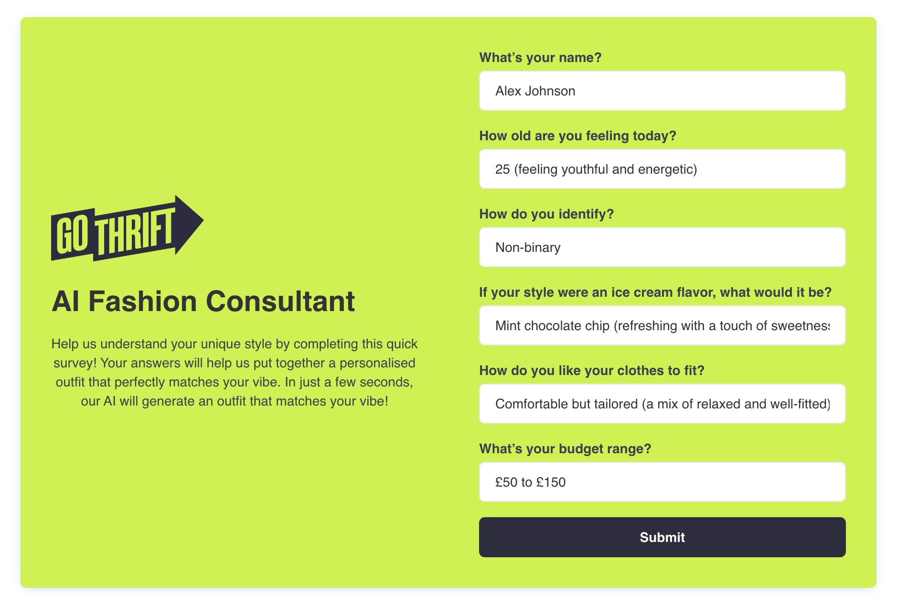
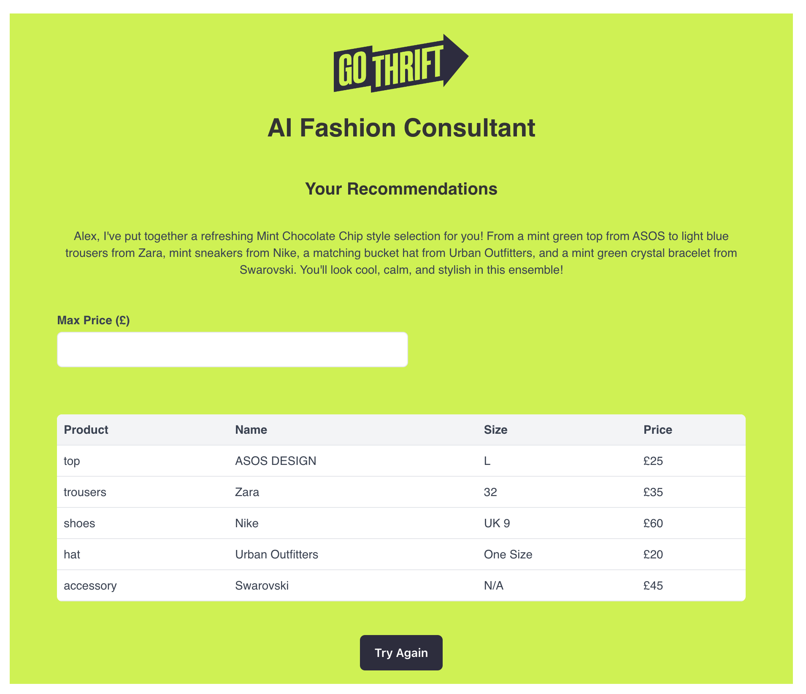

# AI Fashion Consultant Application

## Introduction

This project is a web application that provides personalised fashion recommendations based on user input. It utilises the OpenAI API to generate tailored fashion advice and displays these recommendations on an intuitive dashboard.

## Demo

You can view a live demo of the application here: [Live Demo](https://d273zjepdp7s3q.cloudfront.net)

## API Integration Choice

### OpenAI API

I chose the OpenAI API due to its advanced natural language processing capabilities, which are ideal for generating personalised and human-like fashion recommendations.

## Key Features

### Dashboard

- **Personalised Recommendations**: Displays fashion items based on user inputs such as name, age, gender, style preference, fit, and budget.
- **Organised Layout**: Clear presentation of recommendations, including item type, brand, color, size, price, and purchase links.
- **User Input Form**: Collects user preferences for generating recommendations.
- **Handling States**: Manages loading and error states effectively, providing user feedback.




## Project Layout

The project is organised into the following structure:

- **1. infra/** -- App Infrastructure

  The code that describes the infrastructure of my serverless app is placed in the infra/ directory of the project

- **2. packages/**

  The Lambda function code that's run when the API is invoked is placed in the packages/functions directory of the project, the packages/core contains my business logic, and the packages/scripts are for any one-off scripts.

- **3. packages/frontend**

  This is the directory of the React Application

## Technologies Used

### Frontend

- **React**
- **TypeScript**
- **AWS Amplify**
- **Vite**
- **Tailwind CSS**

### Backend

- **OpenAI API**
- **AWS Lambda**
- **AWS API Gateway**
- **Serverless Stack**
- **TypeScript**

## Setup and Running Locally

### Prerequisites

- Node.js (v14 or later)
- npm or yarn

### Installation

1. **Clone the Repository**:

   ```bash
   git clone <repository-url>
   cd <repository-directory>
   ```
